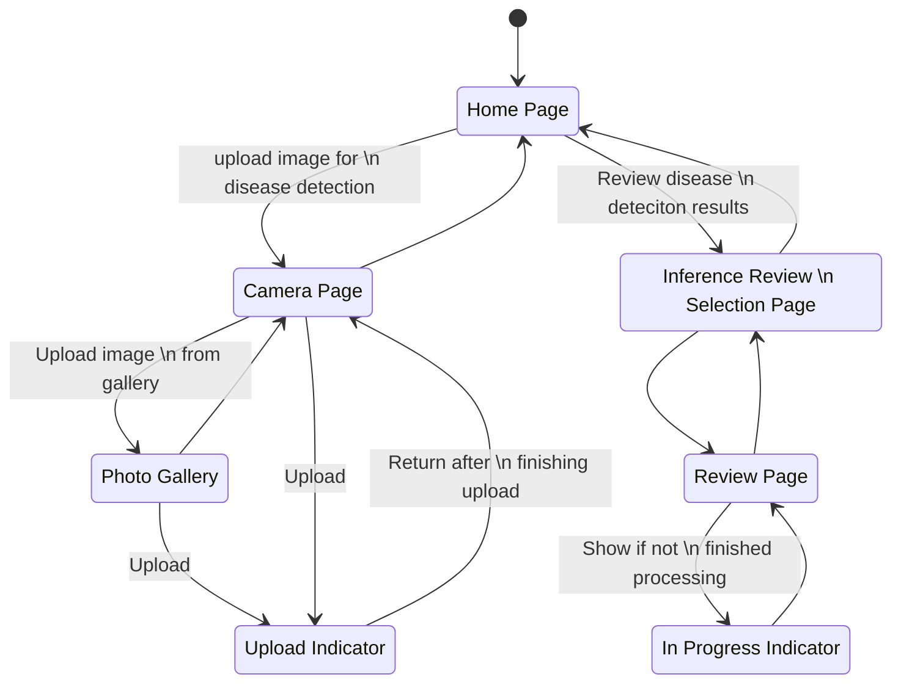

# Workflow documents
This document outline the various workflows in the both the mobile app frontend and backend.

## Disease Detection Workflow (Mobile UI)
This workflow diagram depicts the process the user goes through for selecting and uploading images for disease detection, and additionally the process of how results are displayed in App.

